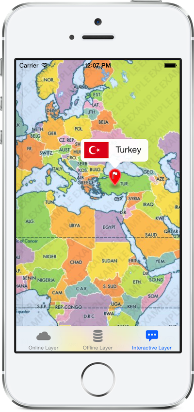

# Mapbox iOS Example

This is an example showing usage of the [Mapbox iOS SDK](https://github.com/mapbox/mapbox-ios-sdk) for: 

 1. Online tile sources (e.g., [Mapbox Hosting](http://mapbox.com/plans/)) with `RMMapboxSource`
 1. Offline tile sources ([MBTiles](http://mbtiles.org)) with `RMMBTilesSource`
 1. Interactive tile sources of both types ([example](http://mapbox.com/demo/visiblemap/)) with `RMInteractiveSource`

